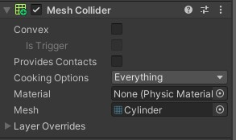

# Cena Colisores
# Feito por: Leonardo Macêdo e Miguel OLiveira
# Link do Projeto
link

# Descrição
Esse é um projeto onde utilizaremos os colisores:  
1. Static Collider  
2. Rigidbody Collider  
3. Kinematic Rigidbody Collider  
4. Static Trigger Collider  
5. Rigidbody Trigger Collider  
6. Kinematic Rigidbody Trigger Collider  

# BelliGol
  

# Cena 1
Fizemos o Morumbi, e o jogador tem que pegar a chuteira em movimento para liberar a passagem para a bola, onde ele chutará no gol e trocará de cena ao tocar na rede.  
Utilizamos GameObjects Modelados no Blender: Morumbi, chueteira e Belligol.  
Do unity: Bola, rede, bloqueio, materiais com imagens e um áudio da torcida do São Paulo cantando o hino.  
  
  

# Cena 2
A cena 2 é quando você faz o gol e é a comemoração do Belligol, e ao cliclar na bola você pode fazer o gol novamente.  
Colocamos um áudio de comemoração do Belligol. 
  
  

# Scripts
## Movimentacao
Foi adicionado ao Belligol e nesse script tem simples códigos para movimentação, rotação de câmera e 'congelar' ele para não tombar.  
  
  
  

## Chuteira
Esse script foi adcionado a chuteira e serve para ele movimentar de um lado para o outro automaticamente. 
  

## Colisoes
Esse script foi adicionado no Belligol, que quando ocorre a colisão com a chuteira desativa o bloqueio, a chuteira é destruida e o texto 1 é desativado enquanto o texto 2 é ativado. 
  

## ForcaNaBola
Esse script foi adicionado no Belligoll, que serve para ele "chutar" a bola, quando ocorre a colisão com ela ma força é aplicada na direção em que o Belligol está olhando. 
  

## TrocarCena
Esse script foi adicionado as redes do gol para quando ocorrer a colisão com a bola carregar a cena 2. 
Também criei um método Jogar para carregar a cena 1, e adicionei ele em um evento de OnClick do botão da bola na cena 2. 
  

# Colisores
## Static Colidder
É um colisor onde o componente fica parado, utilizamos no estádio, nas traves e no bloqueio. Utilizamos Box e Mesh Collider.  
  
  

## RigidBody Collider
Utilizamos esse colisor no Belligol, na chuteira e na bola para dar física para eles. 
  

## Kinematic Rigidbody Collider
Adicionamos ele na chuteira e no Belligol para movimentar eles com scripts. Para isso ativamos a propiedade Is Kinematic. 
  

## Static Trigger Collider
Usamos ele nas redes do gol para quando ocorrer colisão e a bola atravessar mude a cena. Para isso ativamos a propieade Is Trigger, sem a propieade Is Trigger a bola só iria bater e não iria atravessar e responder o script. 
  

## Rigidbody Trigger Collider
Utilizamos ele na chuteira que adicionamos RigidBody para usar Is Kinematic (próximo) e um Box Collider para quando o Belligol atravessar e ocorrer a colisão, libere a segunda parte da cena. Para isso ativamos a propieade Is Trigger. 
  
  

## Kinematic Rigidbody Trigger Collider
Utilizamos ele na chuteira que adicionamos RigidBody para usar o Is Kinematic onde movimentamos a chuteira de um lado para o outro com script. També colocaos um Box Collider para quando o Belligol atravessar e ocorrer a colisão, libere a segunda parte da cena. Para isso ativamos a propieade Is Trigger. Como o Is trigger está ativado a física não irá responder. 
  
  

# Cena rodando com todos os colisores
